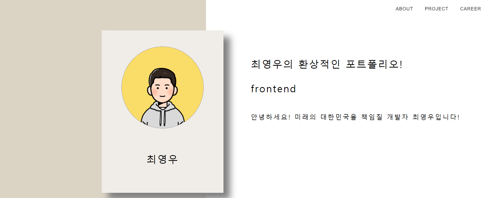
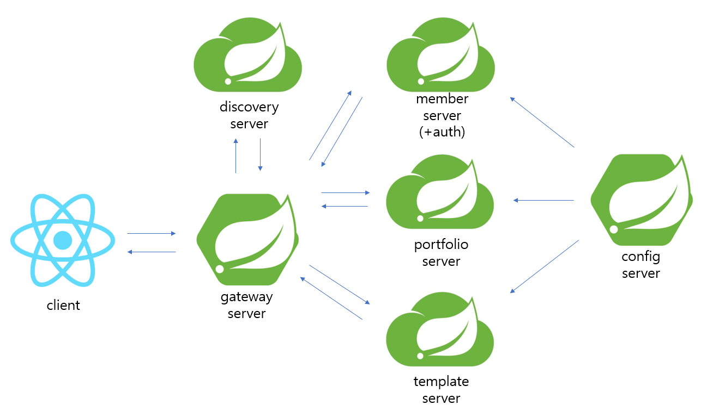

# APPEAL MSA PROJECT BACKEND API
- SERVICE URL : <http://www.appeal.icu/>
- 테스트 이메일 : ma8511@naver.com
- 테스트 비밀번호 : 123412
- 서비스 소개 : 서비스 템플릿으로 개인 포트폴리오를 작성할 수 있습니다 ^^

# 프로젝트 버전
- [이전버전](https://github.com/cjswoduddn/appeal-api) 에서 마이크로 서비스로 전환 중

# 클라우드 아키텍처

# 사용자 인증 방법
- Cookie-Session -> JWT 토큰 인증 변경
- spring security 사용
- OAuth2.0 지원 예정

# Database
- 프레임워크 : spring boot data jpa + hibernate
- 개발환경 DB : H2
- 배포환경 DB : mysql 사용 예정

# Message Queue
- rabbitMQ : config server의 변경 전달 미들웨어
- kafka : 사용 예정

# 빌드 및 배포
todo(젠킨스 예정)

# 컨테이너 가상화
todo(docker + 쿠버네티스 예정)

